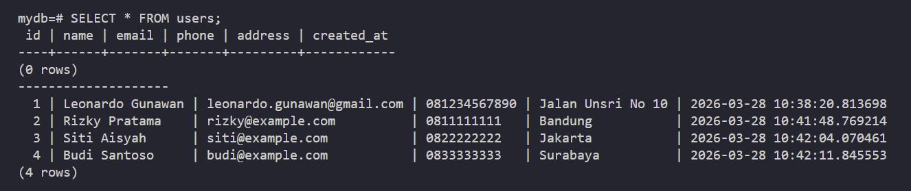
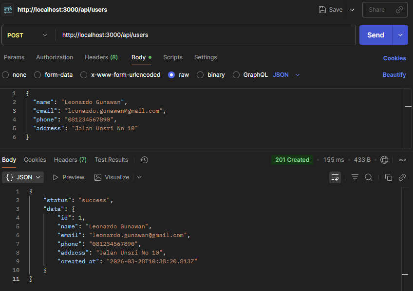

# Docker Task Week 4 - Dockerized Simple REST API 
Projek ini membuat satu REST API sederhana dengan endpoint POST yang terhubung ke PostgreSQL, berjalan sepenuhnya melalui Docker Compose dan dikelola menggunakan Git.

---

## 🚀Tech Stack 
| Teknologi | Keterangan|
| :--------------- | :---------------------------------------------------- |
| **Node.js**  | Runtime|
| **Express.js**| Framework|
| **PostgreSQL 15**| Database|
| **node-postgres (pg)**| Driver|
| **Docker & Docker Compose**| Container|
| **dotenv**| Environment Variable Handler|

## 📁 Struktur Projek
```
docker-assignment/
├── src/
│   ├── config/
│   │   └── db.js
│   ├── controllers/
│   │   └── userController.js
│   ├── models/
│   │   └── userModels.js
│   ├── routes/
│   │   └── userRoutes.js
│   └── server.js
├── .env.example
├── .gitignore
├── Dockerfile
├── docker-compose.yml
├── package-lock.json
├── package.json
└── README.md
```

## ⚙️ Instalasi & Konfigurasi
### 1️⃣ Clone Repository
```bash
git clone https://github.com/lnrdgnwn/docker-assignment.git
cd docker-assignment
```

### 2️⃣ Setup Environment
Buat file .env pada direktori root (utama) proyek dengan mengisi konfigurasi dari .env.example:
```bash
DB_HOST=localhost
DB_PORT=your_port_here
DB_USER=your_username_here
DB_PASSWORD=your_password_here
DB_NAME=your_db_name_here

APP_PORT=3000
```

### 3️⃣ Install Depedencies
```bash
npm install
```

### 4️⃣ Build & Run Container Dockers
```bash
docker-compose up -d
docker ps
```
Service yang berjalan :
- backend_app → Express API
- docker_db → PostgreSQL

### 5️⃣ Jalankan Server (jika diperlukan)
```bash
npm start # jika diperlukan
```

## 📌 API Endpoints

| Method | Endpoint | Deskripsi |
|--------|----------|-----------|
| `POST` | `/api/users` | Tambah users baru |

## 📦 Contoh Request & Response API

### POST /api/users

**Request Body:**
```json
{
  "name": "Leonardo Gunawan",
  "email": "leonardo.gunawan@gmail.com",
  "phone": "081234567890",
  "address": "Jalan Unsri No 10"
}
```

**Response 201 Created:**
```json
{
    "status": "success",
    "data": {
        "id": 1,
        "name": "Leonardo Gunawan",
        "email": "leonardo.gunawan@gmail.com",
        "phone": "081234567890",
        "address": "Jalan Unsri No 10",
        "created_at": "2026-03-28T10:09:32.581Z"
    }
}
```

## 📸 Screenshot Postman
### 1️⃣ Raw Data
> 
### 2️⃣ Success Created User With Status 201 Response
> 
